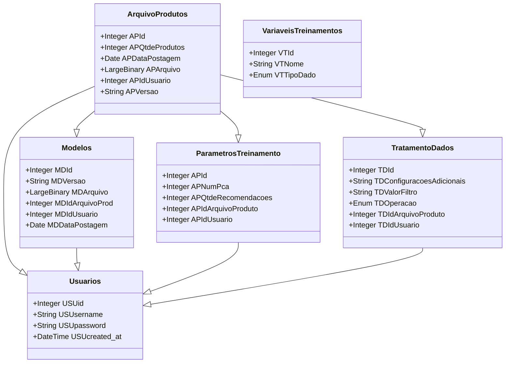

## Índices
* [Objetivo](#Objetivo)
* [Requisitos do Projeto](#Requisitos-do-Projeto)
  *  [Requisitos Funcionais](#Requisitos-Funcionais)
  *  [Requisitos Não Funcionais](#Requisitos-Não-Funcionais)

* [Tecnologias Utilizadas](#Tecnologias-Utilizadas)
  * [Back-End](#Back-End)
  * [CI/CD](#CICD)
  * [Banco De Dados](#Banco-de-dados)
  * [Testes de Qualidade](#Testes-de-qualidade)
* [Como iniciar o projeto](#Como-iniciar)
  * [Banco de dados](#Iniciar-Banco-de-dados)
  * [Repositório](#Repositório)
* [Alertas e recomendações](#Alertas-e-Recomendações)

# Objetivo
Este projeto tem como objetivo fornecer todas as ferramentas, assim como o algoritmo pronto para recomendação de produtos similares levando em conta um produto base. Com foco em facilitar o uso da ferramenta para tratamento de dados e também para o treinamento do algoritmo para a recomendação. Neste repositório terá um dataset base juntamente com todos os jsons para popular o banco de dados para a demonstração do funcionamento do serviço.

# Escopo
1. Conta de usuário
   * Criação de conta de usuário.
   * Alterar a senha do usuário.
3. Manipulação de arquivos CSV
   * Upload de arquivo CSV.
   * Remoção de arquivo.
5. Tratamento de dados
   * Editar valor de campo desejado.
   * Remover valor desejado.
   * Substituir valor desejado.
   * Deletar registro de tratamento de dados de um arquivo CSV específico.
6. Configuração de treinamento
   * Criar parametros de treinamento vinculado ao arquivo CSV.
   * Editar parametros de treinamento para um arquivo específico.
   * Remover parametros de treinamento para um arquivo específico.

# Requisitos do Projeto
## Requisitos Funcionais
### 1. Autenticação e Autorização
* RF01 - Cadastro de Usuário: O sistema deve permitir que o usuário cadastre uma conta utilizando nome de usuário e senha.
* RF02 - Login de Usuário: O sistema deve permitir que o usuário faça login com suas credenciais para acessar a API.
* RF03 - Autorização por Token: O sistema deve fornecer um token JWT (JSON Web Token) ou outra forma de autenticação para cada usuário após o login, que será utilizado para autorizar o acesso aos recursos da API.
### 2. Manipulação de Dataset
* RF04 - Upload de Dataset: O sistema deve permitir que o usuário faça upload de um arquivo CSV contendo um dataset de produtos. O dataset deve conter as colunas necessárias que foram cadastradas no painel de variáveis de treinamento.
* RF05 - Listagem de Datasets: O sistema deve permitir que o usuário visualize todos os datasets que ele já enviou.
* RF06 - Detalhes do Dataset: O sistema deve permitir que o usuário visualize detalhes de um dataset específico, como número de registros e amostra de dados.
* RF07 - Validação do Dataset: O sistema deve validar o formato do dataset, verificando se todas as colunas obrigatórias estão presentes e se o conteúdo segue o padrão esperado (por exemplo, tipos de dados corretos).
* RF08 - Remoção de Dataset: O sistema deve permitir que o usuário apague um dataset que ele tenha enviado previamente.
### 3. Definição de Regras de Tratamento de Dados
* RF09 - Cadastro de Regras de Tratamento de Dados: O sistema deve permitir que o usuário defina como os dados do dataset devem ser tratados. Exemplo de regras:
Filtros específicos (por exemplo, remover registros de uma determinada seção).
* RF10 - Listagem de Regras de Tratamento: O sistema deve permitir que o usuário visualize as regras de tratamento associadas a um dataset.
* RF11 - Edição de Regras de Tratamento: O sistema deve permitir que o usuário edite ou remova regras de tratamento de dados previamente cadastradas.
* RF12 - Aplicação de Regras de Tratamento: O sistema deve permitir que o usuário aplique as regras de tratamento em um dataset e visualize o resultado do tratamento (dataset limpo).
### 4. Treinamento do Modelo de Recomendação
* RF13 - Treinamento de Modelo: O sistema deve permitir que o usuário envie uma requisição para treinar um modelo de recomendação de produtos executando o tratamento de dados com base nos registros associados ao dataset.
* RF14 - Configuração do Modelo: O sistema deve permitir que o usuário defina algumas configurações para o treinamento do modelo, como:
  * Número de componentes
  * Quantidade de produtos que serão recomendados
* RF15 - Acompanhamento de Status de Treinamento: O sistema deve fornecer um status atualizado do processo de treinamento, como "Em andamento", "Concluído" ou "Falhou", além de disponibilizar logs de erros, se necessário.
### 5. Avaliação e Recomendação de Produtos
* RF16 - Retorno de Recomendações: O sistema deve retornar uma lista de produtos recomendados com base no modelo treinado. Isto vale para recomendação de apenas um único produto ou da base toda.

## Requisitos Não Funcionais
### 1. Usabilidade
* RNF1 - Interface Intuitiva (API e Dashboard): A API deve ter endpoints bem documentados (por exemplo, utilizando Swagger ou API Blueprint), para facilitar a compreensão e utilização por desenvolvedores. Caso haja uma interface gráfica (dashboard), ela deve ser intuitiva e de fácil navegação.
* RNF2 - Documentação Completa: A API deve ser acompanhada por uma documentação clara e detalhada, explicando todos os endpoints, parâmetros, exemplos de uso e códigos de resposta.
### 2. Confiabilidade
* RNF3 - Tolerância a Falhas: O sistema deve ser resiliente, garantindo que falhas em um módulo não comprometam o funcionamento de outros módulos. Ele deve ser capaz de retomar o processamento após falhas e salvar o estado das operações críticas.
* RNF4 - Backup e Recuperação: O sistema deve realizar backups periódicos dos dados (datasets, modelos treinados e logs), com mecanismos de recuperação em caso de falhas ou perda de dados.
* RNF5 - Consistência dos Dados: Em caso de falhas durante operações críticas, como a aplicação de regras de tratamento ou treinamento de modelos, o sistema deve garantir que os dados permanecem consistentes, evitando estados intermediários corrompidos.

# Tecnologias Utilizadas

### Back-End
  * Python
    * Poetry
      * Flask
      * SkLearn
      * Pandas
      * Numpy
      * Re
   
### Banco de dados
  * SQL Server
#### Diagrama de entidade

### CI/CD
* Jenkins

### Testes de qualidade
* PyUnit: É uma biblioteca para realização de testes unitários em Python baseada na arquitetura xUnit. É a forma mais difundida para realizar a prática de testes unitários pela comunidade Python.
   * Foram realizados diversos testes com foco em ter a porcentagem de cobertura de testes em 100%, desde em endpoints de usuário até testes em cada entidade afim de testar o fluxo de todo o CRUD.

# Como iniciar
### Iniciar Banco de dados
> [!WARNING]
> Este projeto utiliza SQL Server.
  1. Baixe o SQL Server neste link: https://www.microsoft.com/pt-br/sql-server/sql-server-downloads
  2. Inicie sua instância do SQL Server.
  3. Abra o arquivo conf.ini que tem de exemplo e preencha cada variável necessária na classe ConfiguracaoBancoDados.
     * As variáveis que devem ser preenchidas são:
       * DRIVER | Exemplo = ODBC Driver 17 for SQL Server
       * SERVER | Exemplo = localhost
       * DATABASE | Exemplo = RecomendacaoProdutos

## Repositório
Para clonar o repositório, você precisa ter o Git Bash, GitHub Desktop ou se preferir pode clonar o projeto via CURL/WGET.

1. Faça o clone do repositório
    * Git Bash: git clone https://github.com/AmarildoZoletJunior/ProjetoTCCPrivado.git
    * Curl: curl -L https://github.com/AmarildoZoletJunior/ProjetoTCCPrivado/archive/refs/heads/master.zip --output ProjetoTCCPrivado.zip
2. Para instalar todas as dependências do poetry, inicie um cmd apontado para a pasta principal do projeto.
    * Digite `pip install poetry`
    * Após o download, verifique se foi feito o download 100% sem erros.
    * Digite `poetry install` e verifique se foi instalado 100% sem erros.
    * Digite `poetry shell` dentro da pasta em que está localizado o arquivo poetry.lock
    * Após ele entrar no shell do poetry, digite `flask run --debug`

3. Para executar requisições em endpoints protegidos pelo JWT
    * no Endpoint `http://<ip>:<porta>/login`, utilize as seguintes credenciais:
      * Usuário: admin
      * Senha: admin
    * Após isto, em todo Endpoint que está protegido, faça autenticação utilizando a header `Authorization` e o valor inicial `Bearer SEU-TOKEN`

# Alertas e Recomendações
> [!WARNING]
> As recomendações dependem 100% da qualidade dos dados, então esteja ciente que você deve ter um dataset que tenha pelo menos duas features, e que exista alguma similaridade entre os dados de cada feature.

> [!CAUTION]
> Para realizar novos treinamentos, somente é aceito arquivos CSV. Caso não seja importado arquivo no formato CSV, não será gerado um novo modelo treinado.

# Contribuições
> [!NOTE]
> Para contribuir com este projeto, abra um pull request para que possamos analisar suas edições e aprovar/rejeitar.

